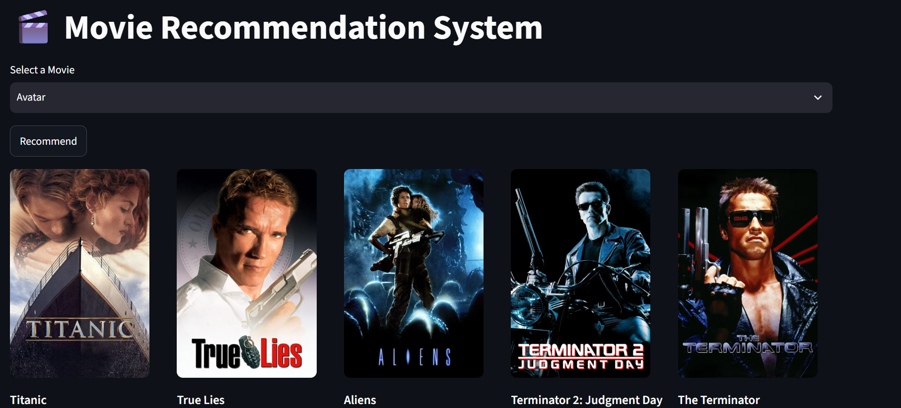

# 🎬 Movie Recommendation System

A content-based Movie Recommendation System built using **Python**, **Streamlit**, **Scikit-learn**, and the **TMDB API**. The application recommends movies similar to the one selected by the user and displays their posters in an interactive web interface.

---

## 🚀 Live Demo

🔗[ https://your-streamlit-app.streamlit.app](https://adarsh-shukla-07-movie-recommendation-system-app-idbf8e.streamlit.app/)

---

## 📸 Application Preview

### Home Page



---

## ✨ Features

- 🎥 Content-Based Movie Recommendation
- 🖼️ Fetches Movie Posters using TMDB API
- ⚡ Fast Recommendations using Cosine Similarity
- 🎨 Interactive Streamlit User Interface
- 🔍 Search from thousands of movies
- ☁️ Deployed on Streamlit Community Cloud

---

## 🛠 Tech Stack

| Technology | Purpose |
|------------|----------|
| Python | Programming Language |
| Streamlit | Web Application |
| Pandas | Data Processing |
| Scikit-learn | Cosine Similarity |
| Requests | TMDB API Calls |
| Pickle | Model Storage |
| Git & GitHub | Version Control |

---

## 📂 Project Structure

```text
Movie-Recommendation-System/
│
├── app.py
├── movies.pkl
├── similarity.pkl
├── requirements.txt
├── README.md
├── .gitignore
└── images/
    └── home.png
```

---

## ⚙️ Installation

Clone the repository

```bash
git clone https://github.com/Adarsh-shukla-07/Movie-Recommendation-System.git
```

Go to the project folder

```bash
cd Movie-Recommendation-System
```

Install dependencies

```bash
pip install -r requirements.txt
```

Create a `.env` file

```env
TMDB_API_KEY=YOUR_API_KEY
```

Run the application

```bash
streamlit run app.py
```

---

## 🧠 How It Works

1. User selects a movie.
2. The recommendation model finds similar movies using cosine similarity.
3. TMDB API fetches posters for the recommended movies.
4. Streamlit displays the recommendations in an attractive layout.

---

## 📷 Screenshot


---

## 👨‍💻 Author

**Adarsh Shukla**

📧 Email: 2k23mca2314073@gmail.com

GitHub: https://github.com/Adarsh-shukla-07

---

## ⭐ Support

If you like this project, don't forget to ⭐ star the repository.
